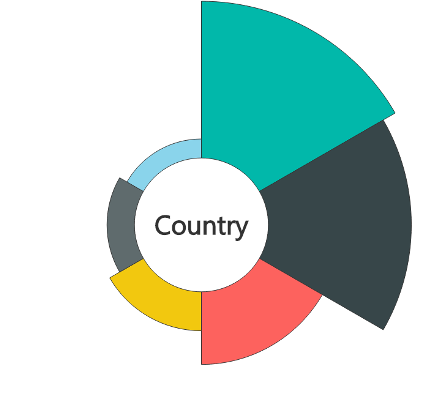

# PowerBI-visuals-AsterPlot

> An Aster plot is a twist on a standard donut chart, using a second value to drive sweep angle.

# Overview
The Aster Plot allows a category that drives the chart and up to 2 measures:

The first measure controls the depth of each section

The second measure controls the width of each section

See also [Aster Plot chart at Microsoft Office store](https://store.office.com/en-us/app.aspx?assetid=WA104380759&sourcecorrid=dd768b2b-0dc9-44e7-8c0e-01a6f95349d6&searchapppos=0&ui=en-US&rs=en-US&ad=US&appredirect=false)
